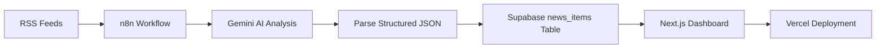

# Daily News Dashboard｜每日情報儀表板

[繁體中文](#繁體中文版) | [English](#english-version)

---

# 繁體中文版

## 專案介紹

**Daily News Dashboard｜每日情報儀表板** 是一個結合 **Next.js、Supabase、n8n 與 Gemini API** 的自動化 AI 新聞整理平台。

此專案會透過 n8n 從不同 RSS 來源抓取新聞，使用 Gemini 進行翻譯、摘要、重要性評分與結構化分析，再將結果寫入 Supabase，最後以前端儀表板呈現國際新聞、台灣新聞、AI 科技與股票市場等內容。

## 線上展示

- Live Demo: https://daily-news-dashboard-rho.vercel.app

## 專案目標

此專案的主要目標，是實作一個完整的「自動化資訊產品」流程，包含：

- 使用 n8n 自動抓取與整理外部資料
- 將 Gemini 的 AI 輸出轉換成可寫入資料庫的結構化 JSON
- 使用 Supabase 儲存分析結果
- 以 Next.js 建立可切換中英文的資訊儀表板
- 將網站部署至 Vercel，完成可公開瀏覽的產品雛形

## 核心功能

### 1. 四大新聞分類

- 國際新聞
- 台灣新聞
- AI 與未來科技
- 股票市場

### 2. AI 新聞分析

每篇新聞會透過 Gemini 產生：

- 英文標題
- 繁體中文標題
- 英文摘要
- 繁體中文摘要
- 原始語言辨識
- AI 重要性分數（Importance Score）

股票市場分類額外包含：

- 市場情緒（Sentiment）
- 受影響市場（Affected Market）
- 短期影響（Short-term Impact）
- 金融相關欄位的繁體中文版本

### 3. 自動化資料流程

- RSS 新聞來源擷取
- Gemini AI 結構化分析
- Duplicate article URL 自動判斷
- 已存在文章自動更新
- 排程化工作流
- 等待節點降低 API 瞬間請求壓力

### 4. 前端互動設計

- 全站中英文切換
- 依分類顯示新聞區塊
- 依 AI 分數排序文章
- 摘要展開 / 收合
- 顯示更多文章按鈕
- 深色主題與響應式版面

## 技術架構

| 層級 | 使用工具 |
|---|---|
| 前端 | Next.js, React, TypeScript, Tailwind CSS |
| 資料庫 | Supabase |
| 自動化 | n8n |
| AI 分析 | Gemini API |
| 部署 | Vercel |
| 版本控管 | GitHub |

## 系統架構圖



## Workflow 流程

每一條自動化流程大致如下：

1. 讀取 RSS 新聞資料
2. 標準化來源欄位
3. 選取指定數量的候選新聞
4. 呼叫 Gemini 進行 AI 分析
5. 解析結構化 JSON 回應
6. 將結果寫入 Supabase
7. 若文章 URL 已存在，則改為更新既有資料

股票市場 workflow 另外會生成：

- 市場情緒
- 受影響市場
- 短期影響
- 對應繁體中文欄位

## 資料庫設計

主要資料表為 `news_items`，包含：

- category
- title / summary
- source
- published_at
- article_url
- importance_score
- title_en / title_zh
- summary_en / summary_zh
- original_language
- stock-specific analysis fields

此外，`article_url` 設有 unique constraint，用來避免重複寫入同一篇新聞。

## 部署方式

前端網站部署於 Vercel，並使用 Supabase 的公開環境變數連線：

```env
NEXT_PUBLIC_SUPABASE_URL=
NEXT_PUBLIC_SUPABASE_PUBLISHABLE_KEY=
```

## 目前狀態

此專案已完成完整的 **MVP / 作品集版本**：

- 前端新聞儀表板完成
- Supabase 資料庫串接完成
- Gemini 多語新聞分析完成
- n8n 自動化工作流完成
- Vercel 正式部署完成

### 維運說明

整體自動化設計已完成，但若要長期每天穩定產出完整新聞資料，會受到 **Gemini API 免費額度限制**。因此此專案目前定位為一個完成度高、可公開展示的作品集案例，而非付費長期維運的正式商業服務。

## 這個專案讓我學到的事

- 如何用 n8n 建立具有實際邏輯的自動化流程
- 如何將 RSS 非結構化資料轉換為可儲存的 AI 結構化輸出
- 如何處理重複資料與更新流程
- 如何建立中英文切換的資訊型前端
- 如何串接雲端資料庫並完成正式部署
- 如何評估技術實作與後續營運成本之間的取捨

## 未來可以延伸的方向

- 將多篇文章合併成單次 Gemini 批次請求，降低 API 次數
- 新增 workflow 錯誤通知機制
- 增加歷史新聞查詢與日期篩選
- 增加分類層級的統計與趨勢圖表
- 綁定自訂網域並優化作品集呈現方式

## 專案定位

此 repository 展示的是一個完整的自動化資訊產品案例，整合了：

- 工作流自動化
- AI 內容增強
- 雲端資料庫設計
- 前端開發
- 線上部署

它是一個從資料來源、分析流程到使用者介面都完整串接的 end-to-end 專案。

---

# English Version

## Project Overview

**Daily News Dashboard** is an AI-assisted news intelligence platform built with **Next.js**, **Supabase**, **n8n**, and the **Gemini API**.

The system collects articles from RSS feeds, processes them through automated Gemini analysis workflows, stores structured outputs in Supabase, and presents the results in a bilingual dashboard covering international news, Taiwan news, AI & future technology, and stock market topics.

## Live Demo

- Deployed site: https://daily-news-dashboard-rho.vercel.app

## Project Goal

This project was built to practice an end-to-end automated information product workflow:

- Automating data ingestion with n8n
- Converting AI-generated outputs into structured JSON for database storage
- Storing and querying analyzed content with Supabase
- Building a bilingual dashboard with Next.js
- Deploying a public production version with Vercel

## Key Features

### 1. Four News Sections

- International News
- Taiwan News
- AI & Future Technology
- Stock Market

### 2. AI-Assisted News Analysis

Each article is processed into:

- English title
- Traditional Chinese title
- English summary
- Traditional Chinese summary
- Original language detection
- Importance score for ranking

The Stock Market section additionally includes:

- Sentiment
- Affected market
- Short-term market impact
- Traditional Chinese versions of the finance-related fields

### 3. Automated Workflow Design

- RSS ingestion through n8n
- Gemini-based structured analysis
- Duplicate article detection using article URLs
- Existing-row updates when duplicates are found
- Scheduled workflow execution
- Wait nodes to reduce API burst pressure

### 4. Frontend Experience

- Global EN / 中文 switch
- Category-based dashboard layout
- AI-score-based article ranking
- Expandable article summaries
- "Show more" behavior for longer sections
- Responsive dark-themed interface

## Tech Stack

| Layer | Tools |
|---|---|
| Frontend | Next.js, React, TypeScript, Tailwind CSS |
| Database | Supabase |
| Automation | n8n |
| AI Analysis | Gemini API |
| Deployment | Vercel |
| Version Control | GitHub |

## System Architecture


## Workflow Logic

Each automation workflow follows a similar sequence:

1. Read news items from an RSS feed
2. Normalize source fields
3. Select a limited batch of candidate articles
4. Send the selected items through Gemini for structured analysis
5. Parse the JSON response
6. Insert results into Supabase
7. Detect duplicate article URLs and update existing rows when needed

The Stock Market workflow additionally extracts:

- Sentiment
- Affected market
- Short-term market impact
- Traditional Chinese translations for finance-specific fields

## Database Design

The primary table is `news_items`, which stores:

- category
- title / summary
- source
- published_at
- article_url
- importance_score
- title_en / title_zh
- summary_en / summary_zh
- original_language
- stock-specific analysis fields

A unique constraint on `article_url` prevents duplicate articles from being stored.

## Deployment

The frontend is deployed on Vercel and connects to Supabase through public environment variables:

```env
NEXT_PUBLIC_SUPABASE_URL=
NEXT_PUBLIC_SUPABASE_PUBLISHABLE_KEY=
```

## Current Status

This project has reached a complete **MVP / portfolio-ready milestone**:

- Frontend dashboard completed
- Supabase integration completed
- AI-based multilingual analysis completed
- n8n automation workflows completed
- Production deployment completed

### Operational Note

The automation design is complete. However, fully continuous daily production use is currently limited by the **Gemini API free-tier request quota**. For that reason, this project is preserved as a completed portfolio implementation rather than being scaled into a paid always-on service.

## What I Learned

- Designing production-style low-code automation with n8n
- Turning unstructured RSS content into database-ready AI outputs
- Handling duplicate data and update flows
- Building a multilingual frontend backed by a live database
- Deploying a full-stack dashboard to production
- Evaluating trade-offs between implementation quality and ongoing operating cost

## Future Improvements

Potential next steps include:

- Batch-processing multiple articles in a single Gemini request to reduce API usage
- Adding workflow error notifications
- Building historical archives and date filters
- Adding category-level analytics and trend visualizations
- Connecting a custom domain and refining the portfolio presentation

## Repository Purpose

This repository documents a complete automation-driven dashboard project that combines:

- Workflow automation
- AI-assisted enrichment
- Cloud database design
- Frontend development
- Production deployment

It serves as an end-to-end case study in building a modern automated information product.
