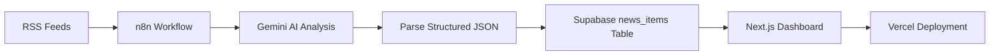

# Daily News Dashboard

An AI-assisted news intelligence dashboard built with **Next.js**, **Supabase**, **n8n**, and the **Gemini API**.

The project collects news from RSS feeds, processes each article through an automated AI analysis workflow, stores structured results in Supabase, and presents them in a bilingual dashboard with category-specific views.

## Live Demo

- Deployed site: https://daily-news-dashboard-rho.vercel.app

## Project Goal

This project was created to practice end-to-end workflow automation and full-stack integration:

- Automating data ingestion with n8n
- Structuring AI-generated outputs for database storage
- Designing a clean, bilingual frontend dashboard
- Connecting scheduled workflows, a cloud database, and a production deployment

## Key Features

- **Four news sections**
  - International News
  - Taiwan News
  - AI & Future Technology
  - Stock Market

- **AI-assisted content processing**
  - English and Traditional Chinese titles
  - English and Traditional Chinese summaries
  - Original language detection
  - Importance score for ranking articles
  - Stock-specific sentiment, affected market, and short-term impact fields

- **Automated workflow design**
  - RSS ingestion via n8n
  - Gemini-based structured analysis
  - Duplicate handling through create/update logic
  - Scheduled workflow execution
  - Delay control to reduce rate-limit pressure

- **Frontend experience**
  - Global EN / 中文 switch
  - Category-based ranking
  - Expandable article summaries
  - "Show more" behavior for larger sections
  - Responsive dark-themed dashboard UI

## Tech Stack

| Layer | Tools |
|---|---|
| Frontend | Next.js, React, TypeScript, Tailwind CSS |
| Database | Supabase |
| Automation | n8n |
| AI Analysis | Gemini API |
| Deployment | Vercel |
| Version Control | GitHub |

## System Architecture



## Workflow Logic

Each automation workflow follows a similar pattern:

1. Read news items from an RSS feed
2. Normalize the source fields
3. Select a limited batch of candidate articles
4. Send items through Gemini for structured analysis
5. Parse the AI JSON response
6. Create new rows in Supabase
7. Detect duplicate article URLs and update existing rows when needed

The Stock Market workflow additionally extracts:

- Sentiment
- Affected market
- Short-term market impact
- Traditional Chinese translations for finance-related fields

## Database Design

The main table is `news_items`, which stores:

- category
- title / summary
- source
- published time
- article URL
- importance score
- multilingual title and summary fields
- stock-specific analysis fields

A unique constraint on `article_url` is used to prevent duplicate articles.

## Deployment

The dashboard is deployed on Vercel and reads data from Supabase through public environment variables:

```env
NEXT_PUBLIC_SUPABASE_URL=
NEXT_PUBLIC_SUPABASE_PUBLISHABLE_KEY=
```

## Current Status

This project has reached a complete **MVP / portfolio-ready milestone**:

- Frontend dashboard completed
- Supabase integration completed
- AI-based multilingual analysis completed
- n8n automation workflows completed
- Production deployment completed

### Operational Note

The automated workflow design is complete, but continuous daily production use is currently limited by the **Gemini API free-tier request quota**. Because the free tier caps daily requests, the project is preserved as a finished implementation and portfolio case rather than being scaled into a paid always-on service.

## What I Learned

- Designing production-style no-code / low-code automation with n8n
- Converting unstructured RSS content into database-ready AI outputs
- Handling duplicate data and update flows
- Building a multilingual frontend backed by a live database
- Deploying a full-stack dashboard to production
- Evaluating technical trade-offs between implementation quality and ongoing operating cost

## Future Improvements

Potential extensions include:

- Batch-processing multiple articles in a single AI request to reduce quota usage
- Error notification workflow for failed scheduled jobs
- Historical article archive and date filters
- Category-level analytics and trend visualizations
- Custom domain and enhanced portfolio presentation

## Repository Purpose

This repository documents a complete automation-driven dashboard project that combines:

- Workflow automation
- AI-assisted enrichment
- Cloud database design
- Frontend development
- Production deployment

It serves as a practical case study in building a modern automated information product from end to end.
